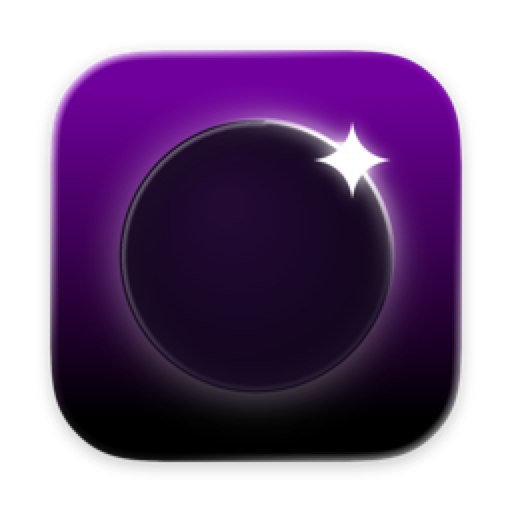

<p align="center">
  
</p>

# Glimmer

A Mac-native client for [Sunshine](https://github.com/LizardByte/Sunshine). Pure
Swift, Apple Silicon only, built so a gaming PC in the other room feels plugged
into your Mac.


The whole pipeline - socket, decoder, display, audio, input - runs in one Swift
process. No external player, no C engine.

## What you get

- **Video.** Hardware-decoded H.264, HEVC, and AV1, 8- and 10-bit, with a real
  HDR10 pipeline. Up to 4K 240 Hz.
- **Pacing.** Locks the display to the stream cadence, runs passthrough on a
  clean link, buffers only for measured jitter. Tuned against per-frame
  telemetry.
- **Audio.** Opus through AVAudioEngine with a small adaptive cushion, so device
  switches and rough Wi-Fi don't crackle.
- **Controllers.** Xbox, DualSense and every other pad macOS supports, plus
  other USB and Bluetooth HID gamepads through SDL's controller database (those
  need Input Monitoring). Rumble, trigger rumble, gyro, touchpad, battery and
  light bar, whatever the pad has. Hold-to-stop chord. An optional raw-input
  mode (off by default, needs Input Monitoring) adds the DualSense buttons macOS
  hides and the host's adaptive-trigger effects.
- **Mouse and keyboard.** Raw 1:1 aim at your Mac's tracking speed with the
  acceleration curve removed, an optional velocity-gated boost on fast flicks,
  optional ⌘-shortcut forwarding.
- **Wi-Fi.** An optional helper parks AWDL (AirDrop's radio time-share) during a
  stream - the usual cause of multi-second Wi-Fi freezes.
- **Hosts.** mDNS discovery, PIN pairing, hosts by IP or name (Tailscale works),
  one-time import of moonlight-qt pairings.
- **Mac things.** Menu bar item, display-matched quality presets, stats overlay,
  hotkeys, notarized, self-updating. Shortcuts, Siri and Spotlight actions
  stream from a PC, wake it, or quit the app it's running.

No accounts, no analytics. Glimmer talks to your own PC and, if you leave
updates on, to the update feed; nothing else. Diagnostics are off by default and
write local files under `~/Library/Logs/Glimmer`.

## Install

macOS 26+, Apple Silicon.

```bash
brew tap se7enbrc/glimmer
brew trust --tap se7enbrc/glimmer   # Homebrew requires this for third-party taps
brew install --cask glimmer
```

Or the notarized `.dmg` from
[Releases](https://github.com/Se7enbrc/glimmer/releases). Either way it updates
itself. The cask also links the `glimmer` command. An existing Homebrew install
gets it with `brew upgrade --greedy glimmer` (or
`brew reinstall --cask glimmer`), because the app updates itself outside
Homebrew.

Signed and notarized, not sandboxed, not on the App Store - the Wi-Fi helper
needs that freedom ([docs/SECURITY.md](docs/SECURITY.md)).

Your host needs Sunshine and a display that can present the exact mode you ask
for: a virtual display driver on Windows, a current Sunshine on Linux.
[docs/HOST_SETUP.md](docs/HOST_SETUP.md).

The Wi-Fi helper lives in Settings > Quality > Wi-Fi; macOS asks for one
approval under Login Items & Extensions. If it reports `rejected by BTM`, run
`sudo sfltool resetbtm` once.

## Command line

`glimmer` is the app itself, run from a terminal: it pairs, lists, wakes and
quits headless, and hands a stream to the app so it gets its window. Stream
settings come from Glimmer's Settings. `glimmer help` is the full reference.
Installed from the `.dmg`, choose Glimmer › Install Command Line Tool… once and
macOS asks for an administrator password to link `glimmer` into
`/usr/local/bin`.

```bash
glimmer pair 192.0.2.10          # prints the PIN to enter in Sunshine
glimmer list                     # paired PCs and whether each is ready
glimmer stream "Living Room" Steam --wait
```

Coming from moonlight-qt:

| moonlight-qt                         | Glimmer                               | Difference                                     |
| ------------------------------------ | ------------------------------------- | ---------------------------------------------- |
| `moonlight pair <host> [--pin NNNN]` | `glimmer pair <address> [--pin NNNN]` | None.                                          |
| `moonlight list <host> [--csv]`      | `glimmer list <pc> [--csv]`           | `glimmer list [--csv]` lists the paired PCs.   |
| `moonlight stream <host> <app> ...`  | `glimmer stream <pc> [<app>]`         | The app is optional; see below.                |
| `moonlight quit <host>`              | `glimmer quit <pc>`                   | None.                                          |
|                                      | `glimmer wake <pc> [--wait]`          | Wake on LAN, optionally waiting for an answer. |

Without an app, `glimmer stream` resumes the running app, else follows Settings
› General › Default action. The `--resolution`, `--bitrate` and other
moonlight-qt stream options are refused, since Settings holds them; Glimmer adds
`--force`, `--wait`, `--exit-after-first-frame` and `--json`. The CSV from
`glimmer list <pc> --csv` has Name, ID, HDR Support and Hidden.

`<pc>` is a paired PC's name or address, ignoring case. Exit status: 0 success,
1 failure, 2 usage error, 3 PC unreachable, 4 PC not paired or no paired PC by
that name.

## Build

Xcode 26 (Swift 6) and Homebrew.

```bash
git clone https://github.com/Se7enbrc/glimmer.git
cd glimmer
brew install openssl@3 opus
make
```

`make` builds and installs to /Applications the same way a release ships.
`make app` compile-checks, `make test` runs the unit tests, `make uninstall`
removes it. The engine is under `Glimmer/Stream/`, no submodules.
[docs/ARCHITECTURE.md](docs/ARCHITECTURE.md),
[docs/CONTRIBUTING.md](docs/CONTRIBUTING.md).

## Why not Moonlight

Moonlight is excellent and Glimmer would not exist without it. But moonlight-qt
is a Qt port of cross-platform C++, one layer from the hardware. Glimmer talks
to VideoToolbox, AVAudioEngine, and GameController directly - that is where the
pacing, HDR, and controller work comes from - and it behaves like a Mac app
because it is one.

## Support

Free software, spare time.
[Sponsor it on GitHub](https://github.com/sponsors/Se7enbrc) if it makes your
setup better.

## License

GPLv3. Copyright © 2026 ugfugl.io. See [LICENSE](LICENSE).

The transport is ported from
[moonlight-common-c](https://github.com/moonlight-stream/moonlight-common-c) and
[moonlight-qt](https://github.com/moonlight-stream/moonlight-qt), both GPLv3, so
Glimmer is too. Full acknowledgment in [CREDITS.md](CREDITS.md).
