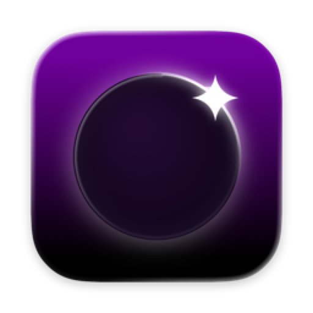
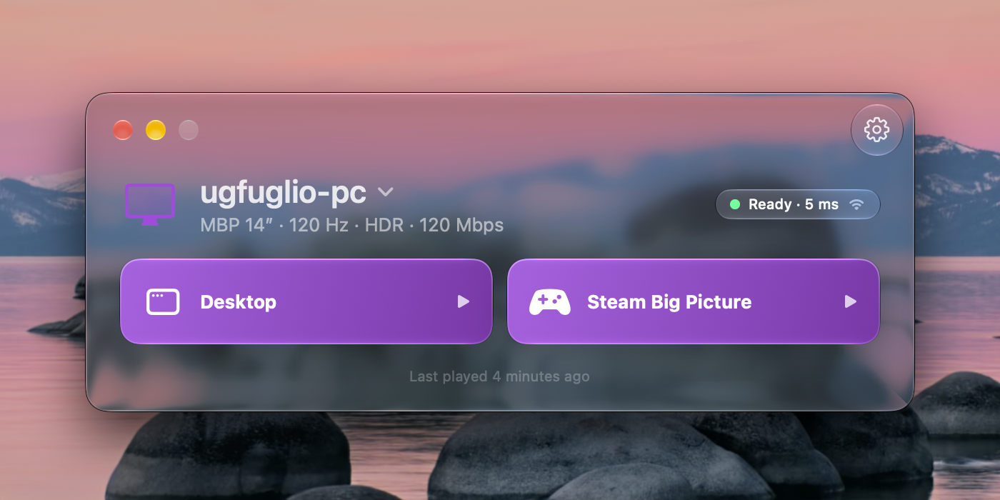

<p align="center">
  
</p>

<h1 align="center">Glimmer</h1>

<p align="center">Your gaming PC, on your Mac.</p>

<p align="center">
  <a href="https://glimmer.ugfugl.io">Website</a> ·
  <a href="https://github.com/Se7enbrc/glimmer/releases/latest">Download for Mac</a> ·
  <a href="#install">Homebrew</a> ·
  <a href="docs/SHORTCUTS.md">Shortcuts</a> ·
  <a href=".github/SUPPORT.md">Get help</a>
</p>

<p align="center">
  <a href="https://github.com/Se7enbrc/glimmer/actions/workflows/verify.yml"></a>
  <a href="https://github.com/Se7enbrc/glimmer/actions/workflows/codeql.yml"></a>
  <a href="https://github.com/Se7enbrc/glimmer/releases/latest"></a>
  <a href="#install"></a>
  <a href="https://github.com/Se7enbrc/homebrew-glimmer"></a>
  <a href="docs/RELEASE.md"></a>
  <a href="https://scorecard.dev/viewer/?uri=github.com/Se7enbrc/glimmer"></a>
  <a href="https://www.bestpractices.dev/en/projects/15346"></a>
  <a href="renovate.json"></a>
  <a href="LICENSE"></a>
</p>

<p align="center">
  
</p>

Glimmer is a Mac-native client for
[Sunshine](https://github.com/LizardByte/Sunshine). It streams games from your
PC using Apple's video, audio and input frameworks, with a SwiftUI and AppKit
interface. macOS 26 or later, Apple Silicon. Free, open source, and always free.

## What you get

- **Video.** Hardware-decoded H.264 and HEVC, with AV1 on supported Macs, 8- and
  10-bit, and a real HDR10 pipeline. Up to 4K 240 Hz.
- **Pacing.** Locks the display to the stream cadence, runs passthrough on a
  clean link, buffers only for measured jitter. Tuned against per-frame
  telemetry.
- **Audio.** Stereo, 5.1 and 7.1, decoded by macOS and played through
  AVAudioEngine with a small adaptive cushion and recovery after device switches
  and network interruptions. Spatial playback follows your audio output, with
  head tracking on compatible AirPods and no in-app setting to manage.
- **Controllers.** Xbox, DualSense and every other pad macOS supports, plus
  other USB and Bluetooth HID gamepads through SDL's controller database (those
  need Input Monitoring). Rumble, trigger rumble, gyro, touchpad, battery and
  light bar, whatever the pad has. Hold-to-stop chord. An optional raw-input
  mode (off by default, needs Input Monitoring) adds the DualSense buttons macOS
  hides and the game's adaptive-trigger effects.
- **Mouse and keyboard.** Raw 1:1 aim at your Mac's tracking speed with the
  acceleration curve removed, an optional velocity-gated boost on fast flicks,
  optional ⌘-shortcut forwarding.
- **Wi-Fi.** A helper parks AWDL (AirDrop's radio time-share), which can
  interrupt Wi-Fi streams. Glimmer offers it the first time it opens.
- **PCs.** mDNS discovery, PIN pairing, PCs by address or name (Tailscale
  works), Wake on LAN and a one-time import of moonlight-qt pairings.
- **Mac things.** Menu bar item, mini player, display-matched quality presets,
  stats overlay, hotkeys, notarized, self-updating. Shortcuts, Siri and
  Spotlight actions stream from a PC, wake it, or quit the app it's running.

Free, now and always. No accounts, no analytics. Glimmer talks to your own PC
and, if you leave updates on, to the update feed; nothing else. Diagnostics are
off by default, write local files under `~/Library/Logs/Glimmer`, and show your
PC's address and names as short codes.

## Install

macOS 26+, Apple Silicon.

```bash
brew tap se7enbrc/glimmer
brew trust --tap se7enbrc/glimmer   # Homebrew requires this for third-party taps
brew install --cask glimmer
```

Or the notarized `.dmg` from
[Releases](https://github.com/Se7enbrc/glimmer/releases). Either way it updates
itself. The cask also links the `glimmer` command. An existing Homebrew install
gets it with `brew upgrade --greedy glimmer` (or
`brew reinstall --cask glimmer`), because the app updates itself outside
Homebrew.

Signed and notarized, distributed outside the App Store. Glimmer runs without
App Sandbox and offers an optional administrator-approved Wi-Fi helper
([security details](docs/SECURITY.md)).

Glimmer has earned the
[OpenSSF Best Practices Passing badge](https://www.bestpractices.dev/en/projects/15346).
The public assessment records the evidence and protocol limitations; the
[security roadmap](docs/SECURITY_ROADMAP.md) tracks work toward higher levels.

Your PC needs Sunshine and a display that can present the exact mode you ask
for: a virtual display driver on Windows, a current Sunshine on Linux.
[docs/HOST_SETUP.md](docs/HOST_SETUP.md) walks through it.

The Wi-Fi helper lives in Settings › Quality › Wi-Fi; macOS asks for one
approval under Login Items & Extensions. If registration fails, follow the
recovery guidance shown in Settings. Resetting macOS's entire background-task
database affects other apps too and is not a routine installation step.

If AirPods playback becomes muffled only while a voice app uses their
microphone, try selecting your Mac's microphone or a USB microphone in that app
while leaving AirPods as the output. Apple documents this
[Bluetooth microphone quality change](https://support.apple.com/en-us/102217).
See [Audio on macOS](docs/AUDIO.md) for voice-chat and volume-recovery guidance.

The [shortcut guide](docs/SHORTCUTS.md) covers keyboard and controller
shortcuts, getting the mouse back, and what copy and paste can do. Settings ›
Input shows your current bindings.

## Command line

`glimmer` is the app itself, run from a terminal: it pairs, lists, wakes and
quits headless, and hands a stream to the app so it gets its window. Stream
settings come from Glimmer's Settings. `glimmer help` is the full reference.
Installed from the `.dmg`, choose Glimmer › Install Command Line Tool… once and
macOS asks for an administrator password to link `glimmer` into
`/usr/local/bin`.

```bash
glimmer pair 192.0.2.10          # prints the PIN to enter in Sunshine
glimmer list                     # paired PCs and whether each is ready
glimmer stream "Living Room" Steam --wait
```

Coming from moonlight-qt:

| moonlight-qt                         | Glimmer                               | Difference                                     |
| ------------------------------------ | ------------------------------------- | ---------------------------------------------- |
| `moonlight pair <host> [--pin NNNN]` | `glimmer pair <address> [--pin NNNN]` | None.                                          |
| `moonlight list <host> [--csv]`      | `glimmer list <pc> [--csv]`           | `glimmer list [--csv]` lists the paired PCs.   |
| `moonlight stream <host> <app> ...`  | `glimmer stream <pc> [<app>]`         | The app is optional; see below.                |
| `moonlight quit <host>`              | `glimmer quit <pc>`                   | None.                                          |
|                                      | `glimmer wake <pc> [--wait]`          | Wake on LAN, optionally waiting for an answer. |

Without an app, `glimmer stream` streams the PC's running app, else follows
Settings › General › Start with. The `--resolution`, `--bitrate` and other
moonlight-qt stream options are refused, since Settings holds them; Glimmer adds
`--force`, `--wait`, `--exit-after-first-frame` and `--json`. The CSV from
`glimmer list <pc> --csv` has Name, ID, HDR Support and Hidden.

`<pc>` is a paired PC's name or address, ignoring case. Exit status: 0 success,
1 failure, 2 usage error, 3 PC unreachable, 4 PC not paired or no paired PC by
that name.

## Build

Xcode 26.6 or later (Swift 6, the macOS 26 SDK). Its one third-party library is
[Sparkle](https://sparkle-project.org), for updates.

```bash
git clone https://github.com/Se7enbrc/glimmer.git
cd glimmer
make app
```

`make` builds and installs to /Applications the same way a release ships.
Installation requires Developer ID signing and app/helper provisioning profiles;
see [the signing setup](docs/RELEASE.md#3-signing-credentials). `make app`
compile-checks, `make test` runs the unit tests, `make uninstall` removes it.
The engine is under `Glimmer/Stream/`, no submodules.
[docs/ARCHITECTURE.md](docs/ARCHITECTURE.md),
[docs/CONTRIBUTING.md](docs/CONTRIBUTING.md).

## Why not Moonlight

Moonlight is excellent and Glimmer would not exist without it. Glimmer focuses
on macOS: its streaming engine is written in Swift and uses VideoToolbox,
AVAudioEngine and GameController, with SwiftUI and AppKit for the interface. The
menu bar, Mini Player, Shortcuts and display-matched presets are built around
how you use a Mac.

## Support

Free software, spare time.
[Sponsor it on GitHub](https://github.com/sponsors/Se7enbrc) if it makes your
setup better.

## License

GPLv3. Copyright © 2026 ugfugl.io. See [LICENSE](LICENSE).

The transport is ported from
[moonlight-common-c](https://github.com/moonlight-stream/moonlight-common-c) and
[moonlight-qt](https://github.com/moonlight-stream/moonlight-qt), both GPLv3, so
Glimmer is too. Full acknowledgment in [CREDITS.md](CREDITS.md).
